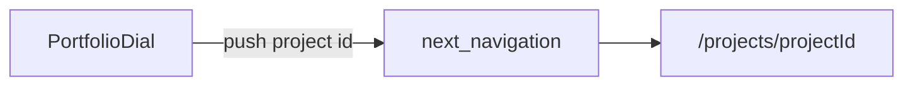

# Project detail page + dial navigation (revised)

## Product decisions (locked in)

- **No overlay / modal.** The dial must **not** open `DetailPanel` (the fixed full-screen “PROJECT FILE” card). That UI path is **removed** from [`PortfolioDial.tsx`](src/components/PortfolioDial/PortfolioDial.tsx).
- **Navigation instead.** Whenever the user chooses **View Project** (desktop CTA, active orbit click, mobile card button, or keyboard **Enter / Space** while the dial is focused), the app goes to **`/projects/[projectId]`** for the **currently active** project (`PROJECTS[activeIdx].id`).

## Context

- Project records: [`src/components/PortfolioDial/projects.ts`](src/components/PortfolioDial/projects.ts) (`Project`, `PROJECTS`).
- Home route only today: [`src/app/page.tsx`](src/app/page.tsx).
- Today’s dial stores `open` state and renders `{open && <DetailPanel ... />}` (~1495–1501). **`DetailPanel`** (from ~778 onward, including **Brackets** used only there if exclusive), **`open` / `setOpen`**, Escape-to-close, and keyboard branches gated on `open` **are to be deleted or simplified** once navigation ships.

## Implementation outline

### 1. Project detail route + template

- Add **`src/app/projects/[projectId]/page.tsx`**: `generateStaticParams` from `PROJECTS`, `notFound()` for bad ids, compose **`ProjectDetailTemplate`** + **`Footer`**.
- Add **`src/components/ProjectDetail/`** template (tsx + CSS module): meta/title, optional hero from `project.image`, brief + metrics (same facts as the old panel, full-page layout), placeholder bands for future content; align type scale with [`DESIGN-SYSTEM.md`](DESIGN-SYSTEM.md) / tokens.

### 2. Dial → router (replace overlay)

- **`PortfolioDial`** becomes a **client** component that already is `"use client"` — use **`useRouter()`** from `next/navigation` with **`router.push(`/projects/${id}`)**`, or wrap CTAs in **`Link`** with stable styling (match existing [`Button`](src/components/ui/Button.tsx) patterns; use `Link` + className or a button-styled anchor if `Button` cannot compose).
- **Replace all `setOpen` / `onOpen` flows** with navigation:
  - **`ActiveCTA`** / **`HeadingItem`** / **`MobileActiveCard`**: pass **`onNavigate(id)`** → `router.push(`/projects/${id}`)** (or equivalent).
  - **Keyboard** (`useEffect` keydown): remove `open` checks and Escape handling; on **Enter / Space**, **`router.push(`/projects/${PROJECTS[activeIdx].id}`)** instead of `setOpen(...)`.
  - **Touch handlers**: drop early returns / guards that existed only because `open` blocked interaction.
- **Delete** the **`DetailPanel`** function and its render site; remove **`open`** state entirely; trim file header comments that mention “open detail panel” / Esc-to-close.

### 3. Verification

- From home, select a project on the dial → **View Project** → lands on **`/projects/<id>`** with **no** overlay flash.
- Direct URL **`/projects/philpotpearce`** (or any valid id) renders the template.
- Build passes; no references to removed `DetailPanel` / `open`.

## Architecture sketch

## Optional later

- **`DetailPanel`-specific helpers** (e.g. **Brackets**) — delete if unused elsewhere; keep shared pieces only if reused by the new template.
